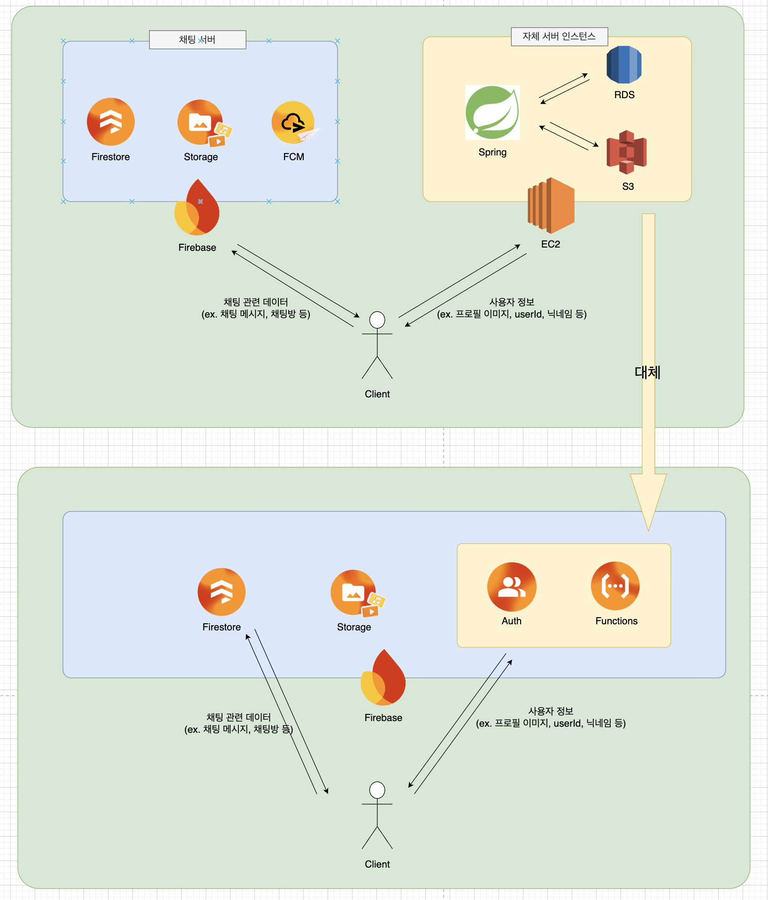

# Firebase Functions

## System Design
<p align="center">
  
</p>

기존 서비스 운영 당시 채팅 시스템 설계 당시 Firebase + AWS 구조로 운영하였습니다. 유저 정보를 Firestore와 AWS RDS에서 이중으로 관리할 경우 데이터 동기화 시 트랜잭션 지연이나 별도 fallback 처리가 필요하므로, **유저 정보는 AWS 자체 서버(EC2 + Spring + RDS)에서 단독 관리**하고 **채팅 관련 데이터는 Firebase에서 단독 관리**하여 데이터 중복이 발생하지 않도록 설계했습니다. 따라서 클라이언트에서는 채팅방/채팅 목록의 사용자 정보를 렌더링할 때는 자체 서버에 API 호출로 유저 데이터를 받아오고, 채팅 메시지와 채팅방 데이터는 Firebase를 통해 받아오는 구조입니다.

그러나 현재 프로젝트는 자체 서버와 연결되어 있지 않기 때문에, 이를 대체하기 위해 **Firebase Auth + Cloud Functions**를 도입했습니다. Functions에서는 기존 자체 서버의 유저 정보 API를 대체하여 사용자 정보 관리 및 채팅방 내 속한 다른 사용자들의 정보 조회(`id`, `nickname`, `profilePhotoUrl` 등) 등의 기능을 제공합니다.

## Schema

### users
> 기존 서비스에서는 AWS RDS에서 관리하던 테이블이었으나, 현재는 Firestore에 저장하고 Cloud Functions를 통해 API로 조회합니다.

```
users/{userId}
├── id: string
├── nickname: string | null
├── profilePhotoUrl: string | null
├── friendIds: string[]
└── chatRooms: string[]
```

### chatRooms
```
chatRooms/{chatRoomId}
├── type: string              // "direct" | "group"
├── lastMessage: string | null
├── lastMessageAt: Timestamp | null
├── index: int
├── userHistory: string[]
├── activeUsers: map<string, Timestamp>
│
└── messages/{messageId}      // sub-collection
    ├── index: int | null
    ├── senderId: string
    ├── type: string          // "text" | "media" | "system"
    ├── content: string | null
    ├── mediaUrls: string[]
    ├── createdAt: Timestamp
    ├── leftUserId: string | null
    └── leftUserNickname: string | null
```

## Setup
- Firebase > Functions > Start
```bash
$ npm install -g firebase-tools
```

> [!Tip]
> 'Firebase Functions' requires the 'Blaze' plan, which allows you to pay as you use. You can get Free $300 credit for 3 Months in GCP.
> https://firebase.blog/posts/2024/11/claim-300-to-get-started

- Project Start
```bash
$ cd ./Backend
$ firebase init

? Which Firebase features do you want to set up for this directory? Press Space to select features, then Enter to confirm your choices.
- Firestore
- Functions

=== Project Setup
...

? Please select an option:
- Use an existing project

? Select a default Firebase project for this directory
- [Project ID](FirebaseChatting)

? Please select the location of your Firestore database:
- asia-northeast3

? What file should be used for Firestore Rules?
- firestore.rules(Default)

? What file should be used for Firestore indexes?
- firestore.indexes.json(Default)

? What language would you like to use to write Cloud Functions?
- Typescript

? Do you want to use ESLint to catch probable bugs and enforce style?
- Y

? Do you want to install dependencies with npm now?
- Y
```

- Build & Deploy
```bash
$ cd functions
$ npm run build
$ firebase deploy --only functions
```

