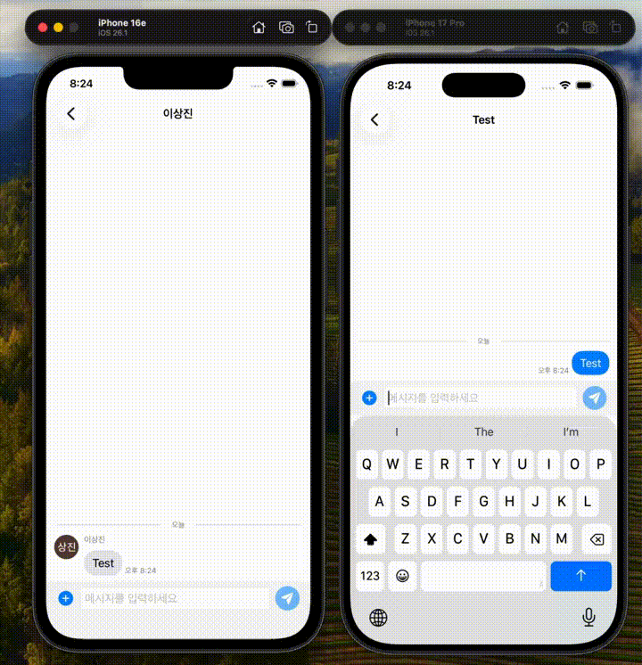
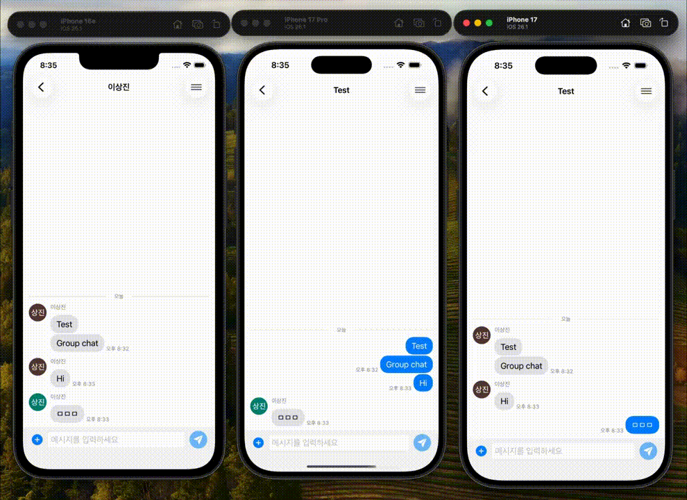
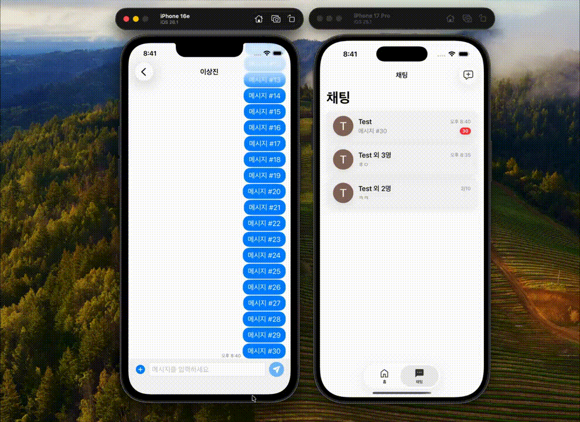
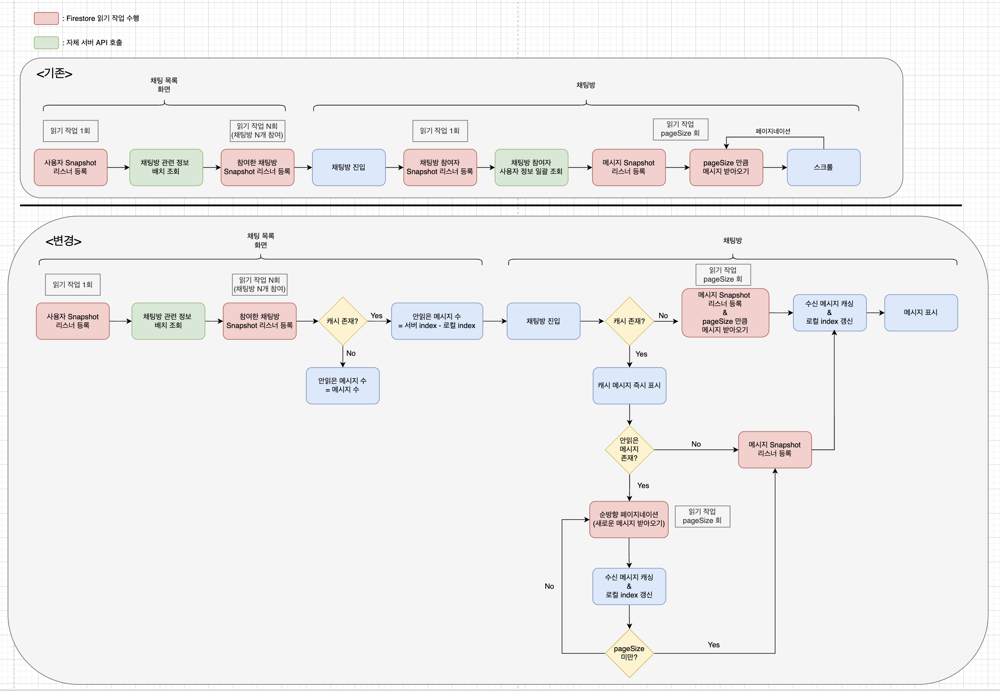
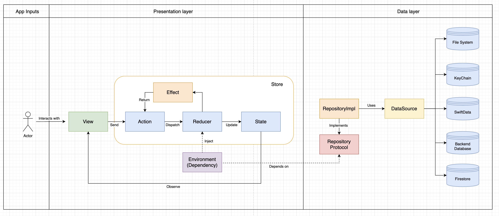

# FirebaseChatting-iOS

기존에 운영하던 채팅 시스템에 추가 기능 구현과 리팩토링을 한 프로젝트입니다.
아키텍처 개선과 함께 **Claude Code를 활용한 테스트 코드 자동화**를 적용하여, 단위/통합/UI 테스트를 체계적으로 구축했습니다.

| 1:1 채팅 | 1:N 채팅 | 안읽은 메시지 + 페이지네이션 |
|:--------:|:--------:|:---------------------------:|
|  |  |  |

### 주요 기능

| 영역 | 기능 | 설명 |
|------|------|------|
| **1:1 채팅** | 메시지 전송/수신 | 텍스트/미디어 전송, Firestore Snapshot 실시간 수신, 페이지네이션 (30개 단위) |
| **1:N 채팅** | 그룹 채팅 | 그룹 생성, 친구 초대, 입장/퇴장 시스템 메시지, 재초대 링크 |
| **채팅방 관리** | 나가기/재입장 | 채팅방 목록에서 스와이프를 통한 채팅방 나가기, 초대를 통한 채팅방 재입장 |
| **미디어** | 이미지/동영상 | 최대 10개 선택, Grid 미리보기 레이아웃, 전체화면 뷰어, Firebase Storage 업로드 |
| **캐싱** | 메시지 캐싱 | SwiftData 로컬 캐시, index 기반 dirty check로 안읽은 메시지 수 계산 |
| **실시간 동기화** | Snapshot Listener | 탭 전환/채팅방 진입에 따른 리스너 생명주기 관리 (등록/해제/재등록) |

### Challenge: 읽기 최적화

<p align="center">
  
</p>

#### 기존(위): Firestore 읽기

| 상황 | 동작 | Firestore Reads |
|------|------|:---------------:|
| 채팅방 진입 | 매번 서버에서 메시지를 새로 fetch | **pageSize만큼 발생** |
| 페이지네이션 | 스크롤할 때마다 서버에서 다음 페이지 fetch | **pageSize만큼 발생** |

#### 변경(아래): SwiftData 캐시 + index 기반 동기화 + Firestore 읽기

| 상황 | 동작 | Firestore Reads |
|------|------|:---------------:|
| 채팅방 진입 | 캐시된 메시지를 즉시 표시하고, Snapshot 리스너로 **새 메시지만** 수신 | **0 reads** (캐시 히트) / pageSize reads (캐시 미스) |
| 페이지네이션 | 로컬 캐시를 먼저 조회하고, 캐시에 없는 메시지만 서버에서 가져옴 | **0 reads** (캐시 히트) / pageSize reads (캐시 미스) |
| 안읽은 메시지 수 | 서버 `index`와 로컬 `index`의 차이로 계산 — 별도 쿼리 불필요, 새로운 UX 제공 | **0 reads** |
| 새로운 메시지 수신 | 캐시에 저장하면서 로컬 `index`도 함께 갱신 → 다음 진입 시 읽기 최소화 | 수신 메시지 수만큼 발생 |

## Tech Stack

### iOS

| 영역 | 기술 |
|------|------|
| UI | SwiftUI |
| Architecture | [TCA (The Composable Architecture)](https://github.com/pointfreeco/swift-composable-architecture) 1.23.1 |
| Navigation | Stack-based (TCA 1.7+ NavigationStack) |
| Async | Swift Concurrency (async/await) |
| Local DB | SwiftData |
| Image Cache | Kingfisher |
| Test | Swift Testing |

### Backend

| 영역 | 기술 |
|------|------|
| Auth | Firebase Auth (Google Sign-In) - 기존 자체 서버에서 JWT 토큰 사용하는 방식을 Auth 로 대체 |
| Database | Cloud Firestore |
| Storage | Firebase Storage |
| Serverless | Firebase Cloud Functions (TypeScript) - 기존 자체 서버 대체용, 유저 정보 관련 API 관리 |

### Claude

Claude Code CLI를 활용하여 프로젝트 전반의 개발 생산성을 높였습니다. `.claude/` 디렉토리에 에이전트, 컨벤션, 템플릿 등을 구성하여 **일관된 코드 생성과 자동화된 테스트 작성**을 구현했습니다.

#### .claude 디렉토리 구조

| 디렉토리 | 설명 |
|----------|------|
| `agents/` | 13개 서브에이전트 정의 (TCA Feature 생성, 테스트 작성, UI 빌드, 코드 리뷰 등) |
| `conventions/` | Swift/TCA 코딩 컨벤션 (네이밍, 파일 구조, 에러 처리 규칙) |
| `skills/` | TDD 워크플로우, 코드 리뷰 프로세스 |
| `templates/` | TCA Feature/View/Test + Liquid Glass UI 컴포넌트 보일러플레이트 템플릿 |
| `test/` | 통합테스트, UI 테스트 시나리오 |

#### 서브에이전트 목록

| 분류 | 에이전트 | 역할 |
|------|----------|------|
| Test | `tca-test-writer` | TCA TestStore 기반 테스트 코드 생성 (TDD 워크플로우) |
| Test | `xctest-agent` | XCTest / Swift Testing 단위 테스트 가이드 |
| Test | `uitest-agent` | XCUITest UI 테스트 및 Page Object 패턴 가이드 |
| Code Review | `swift-code-reviewer` | Swift 코드 리뷰 (컨벤션, 로직, 베스트 프랙티스) |

#### MCP

| MCP 서버 | 용도 |
|----------|------|
| `Context7` | 라이브러리 공식 문서 실시간 조회 (TCA, SwiftUI, Firebase 등) |
| `Sequential Thinking` | 복잡한 문제 분석 시 단계별 사고 체인 |

#### Plugin

| 플러그인 | 용도 |
|----------|------|
| `swift-lsp` | Swift LSP 연동 (코드 자동완성, 타입 추론, 심볼 탐색) |
| `bkit` | PDCA 사이클 관리, Gap 분석, 코드 품질 자동화 |

## Getting Started

### 1. Backend 설정

Firebase Cloud Functions 배포 등 백엔드 사전 작업이 필요합니다.

> [Backend/README.md](Backend/README.md) 참고

### 2. Firebase 연동

1. [Firebase Console](https://console.firebase.google.com/)에서 프로젝트 생성
2. iOS 앱 등록 (Bundle ID 입력)
3. `GoogleService-Info.plist` 다운로드 후 Xcode 프로젝트 루트에 추가
4. Authentication > Google 로그인 활성화
5. Firestore Database / Storage 생성

### 3. 개발 환경

| 요구사항 | 버전 |
|----------|------|
| iOS | 26.0+ |
| Xcode | 26.1+ |
| Swift | 6.2.1 |

## Architecture

TCA (The Composable Architecture)를 채택하여 **단방향 데이터 흐름**과 **의존성 주입 기반 테스트 용이성**을 확보했습니다.

<p align="center">
  
</p>

| 레이어 | 역할 |
|--------|------|
| **Presentation** | TCA Feature (State, Action, Reducer) + SwiftUI View |
| **Data** | Model, Repository (Protocol + Impl), DataSource, DTO |
| **Core** | TCA Dependencies, 공통 유틸, 확장 |

```
FirebaseChatting/
├── App/                    # 앱 진입점 (AppDelegate, App)
├── Core/                   # Dependencies, Extensions, Constants
├── Data/                   # Model, Repository, DataSource, DTO
├── Presentation/           # Feature (Reducer + View), Components
└── Resources/              # Assets, Fonts
```

## Testing

Claude Code를 활용하여 **단위 166개, 통합 22개, UI 7개** 총 195개의 테스트를 자동화했습니다.

| 구분 | 테스트 수 | 범위 | 상세 |
|------|----------|------|------|
| Unit | 166 | 9개 Feature Reducer 로직 | [Features/README.md](FirebaseChattingTests/Features/README.md) |
| Integration | 22 | Auth, ChatList, ChatRoom 다단계 흐름 | [Integration/README.md](FirebaseChattingTests/Integration/README.md) |
| UI (XCUITest) | 7 | 핵심 기능에 대한 주요 사용자 시나리오 | [UITests/README.md](FirebaseChattingUITests/README.md) |