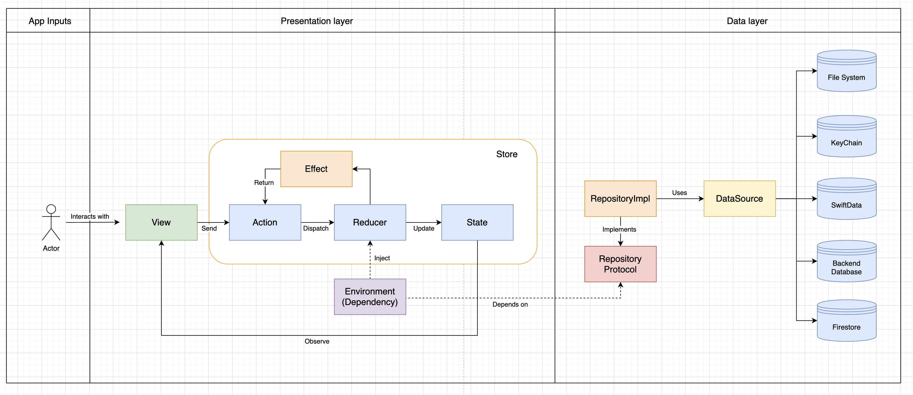

# FirebaseChatting-iOS

기존에 운영하던 채팅 시스템에 추가 기능 구현과 리팩토링을 한 프로젝트입니다.
아키텍처 개선과 함께 **Claude Code를 활용한 테스트 코드 자동화**를 적용하여, 단위/통합/UI 테스트를 체계적으로 구축했습니다.

### 주요 기능

| 영역 | 기능 | 설명 |
|------|------|------|
| **인증** | Google 로그인 | Firebase Auth 연동, 키체인 자동 로그인 |
| **Home** | 친구 목록 | 프로필 표시, 검색, 친구 추가 |
| **1:1 채팅** | 메시지 전송 | 텍스트/미디어, 실시간 수신, 페이지네이션 (30개 단위) |
| **1:N 채팅** | 그룹 채팅 | 그룹 생성, 친구 초대, 입장/퇴장 시스템 메시지 |
| **미디어** | 이미지/동영상 | 최대 10개 선택, 10MB 제한, Grid 레이아웃, 전체화면 뷰어 |
| **채팅방 관리** | 나가기/재입장 | 스와이프 나가기, 1:1 재입장, 전원 퇴장 시 자동 삭제 |
| **실시간 동기화** | Firestore Snapshot | 탭 전환에 따른 리스너 생명주기 관리 |

## Tech Stack

### iOS

| 영역 | 기술 |
|------|------|
| UI | SwiftUI |
| Architecture | [TCA (The Composable Architecture)](https://github.com/pointfreeco/swift-composable-architecture) 1.23.1 |
| Navigation | Stack-based (TCA 1.7+ NavigationStack) |
| Async | Swift Concurrency (async/await) |
| Local DB | SwiftData |
| Image Cache | Kingfisher |
| Test | Swift Testing |

### Backend

| 영역 | 기술 |
|------|------|
| Auth | Firebase Auth (Google Sign-In) - 기존 자체 서버에서 JWT 토큰 사용하는 방식을 Auth 로 대체 |
| Database | Cloud Firestore |
| Storage | Firebase Storage |
| Serverless | Firebase Cloud Functions (TypeScript) - 기존 자체 서버 대체용, 유저 정보 관련 API 관리 |

## Getting Started

### 1. Backend 설정

Firebase Cloud Functions 배포 등 백엔드 사전 작업이 필요합니다.

> [Backend/README.md](Backend/README.md) 참고

### 2. Firebase 연동

1. [Firebase Console](https://console.firebase.google.com/)에서 프로젝트 생성
2. iOS 앱 등록 (Bundle ID 입력)
3. `GoogleService-Info.plist` 다운로드 후 Xcode 프로젝트 루트에 추가
4. Authentication > Google 로그인 활성화
5. Firestore Database / Storage 생성

### 3. 개발 환경

| 요구사항 | 버전 |
|----------|------|
| iOS | 26.0+ |
| Xcode | 26.1+ |
| Swift | 6.2.1 |

## Architecture

TCA (The Composable Architecture)를 채택하여 **단방향 데이터 흐름**과 **의존성 주입 기반 테스트 용이성**을 확보했습니다.

<p align="center">
  
</p>

| 레이어 | 역할 |
|--------|------|
| **Presentation** | TCA Feature (State, Action, Reducer) + SwiftUI View |
| **Data** | Model, Repository (Protocol + Impl), DataSource, DTO |
| **Core** | TCA Dependencies, 공통 유틸, 확장 |

```
FirebaseChatting/
├── App/                    # 앱 진입점 (AppDelegate, App)
├── Core/                   # Dependencies, Extensions, Constants
├── Data/                   # Model, Repository, DataSource, DTO
├── Presentation/           # Feature (Reducer + View), Components
└── Resources/              # Assets, Fonts
```

## Testing

Claude Code를 활용하여 **단위 166개, 통합 22개, UI 7개** 총 195개의 테스트를 자동화했습니다.

| 구분 | 테스트 수 | 범위 | 상세 |
|------|----------|------|------|
| Unit | 166 | 9개 Feature Reducer 로직 | [Features/README.md](FirebaseChattingTests/Features/README.md) |
| Integration | 22 | Auth, ChatList, ChatRoom 다단계 흐름 | [Integration/README.md](FirebaseChattingTests/Integration/README.md) |
| UI (XCUITest) | 7 | 핵심 기능에 대한 주요 사용자 시나리오 | [UITests/README.md](FirebaseChattingUITests/README.md) |